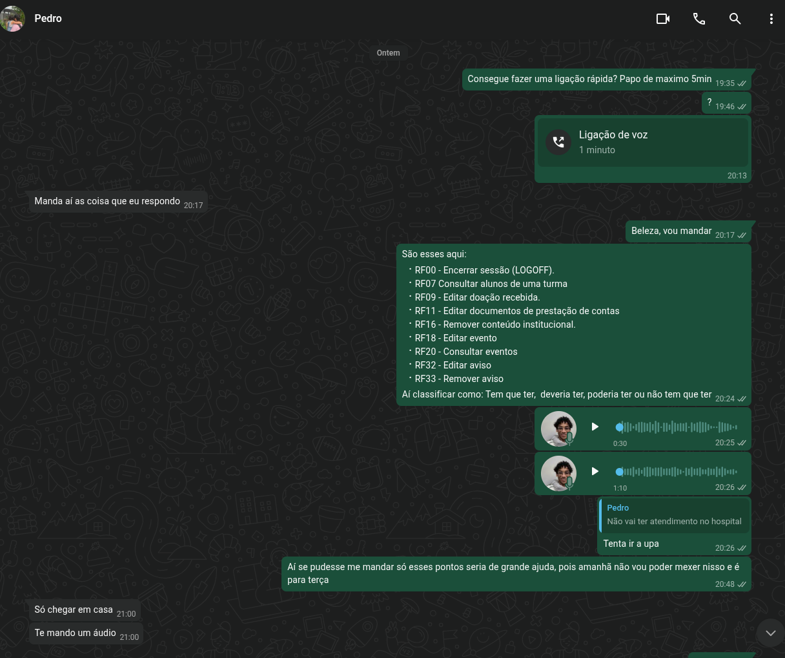
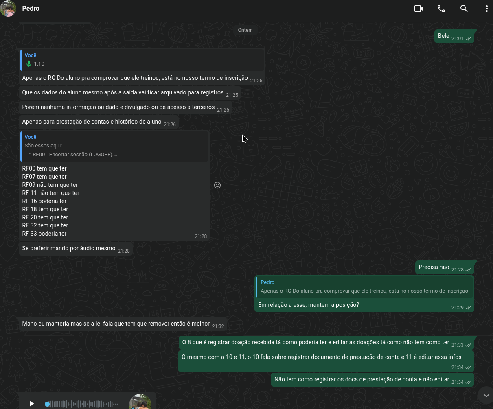
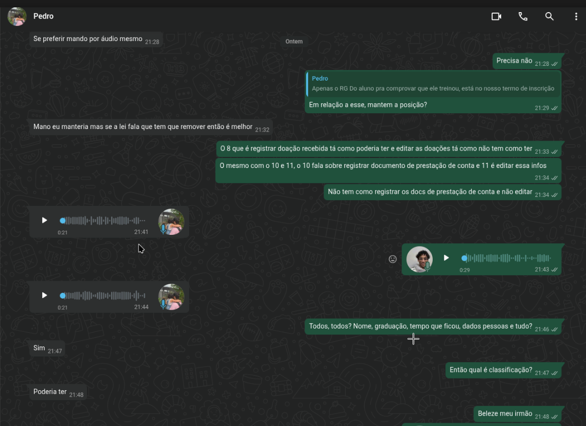

# Apresentação em áudio da Reunião 26/09/2026

Essa reunião foi feita de maneira assincrona pelo WhatsApp e possui áudio e imagens 
A ata dessa reunião pode ser visualizada em [Ata reunião 26/09/2026](../../organizacao_e_planejamento/atas_reunioes/cliente/ata_reuniao_26_09.md) 

## Imagens

## Áudio

<audio controls preload="metadata" style="width: 80%;">
    <source src="../audio/audio_reuniao_26_09.mp3" type="audio/mpeg">
</audio>

## Versionamento

| Versão | Data | Descrição | Autor(es/as) | Revisor(es/as) |
| :--- | :--- | :--- | :--- | :--- |
| 1.0 | 27/09/2026 | Criação e adição do áudio ao documento | [Rafael Melatti](https://github.com/Romm-0) | - |