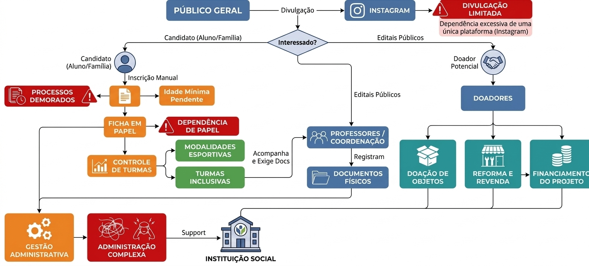

# VISÃO DO PRODUTO E PROJETO

## 1 CENÁRIO ATUAL DO CLIENTE E DO NEGÓCIO

### 1.1 Identificação do Cliente/Parceiro

**Nome:** Centro Esportivo Cultural de Planaltina

**Tipo:** Organização da Sociedade Civil de Interesse Público

**Representante:** Pedro Augusto Cajado Coutinho.

**Forma de contato:** Reuniões periódicas por videoconferência, canal de mensagens instantânea e email.

**Vínculo com o projeto:** Cliente real e parte interessada principal, responsável por fornecer informações sobre o negócio, validar as decisões do projeto e avaliar as entregas realizadas ao longo do desenvolvimento.

### 1.2 Introdução ao Negócio e Contexto

O Centro Esportivo Cultural de Planaltina DF (CECP) é uma organização social brasileira que atua no Distrito Federal desde 2014. Qualificada como Organização da Sociedade Civil de Interesse Público (OSCIP) junto ao Ministério da Justiça, a instituição utiliza as Artes Marciais como ferramenta de prevenção à criminalidade e de promoção do desenvolvimento sociocultural e esportivo da comunidade.

A organização opera de forma presencial, em Planaltina-DF, onde são realizadas as atividades em regime de contraturno escolar. O trabalho é sustentado por um grupo de jovens voluntários, lutadores e profissionais de diversas áreas. Sua presença digital é limitada e fragmentada: o Instagram é o principal canal de divulgação. Embora o domínio e o site institucional permaneçam ativos, o site está desatualizado e não é mais utilizado. Não há, atualmente, uma estrutura digital integrada para a gestão de alunos, documentos, doações e informações institucionais.

A missão do CECP é comprometer jovens líderes com o desenvolvimento da comunidade, formando uma consciência social verdadeira por meio de ações positivas em favor da infância mais necessitada, tendo como valores centrais a amizade, o respeito, a sinceridade e a solidariedade.

O público-alvo principal são crianças e adolescentes, bem como suas famílias, em situação de vulnerabilidade social, sobretudo de baixa renda, em regiões próximas de Planaltina. A comprovação de bom desempenho escolar é exigida para a progressão de faixa, mas não existe sistema digital nem verificação sistemática desse requisito; o controle depende, em grande parte, da boa-fé do aluno. Também há ausência de controle estruturado de frequência, o que dificulta comprovações de participação.

### 1.3 Rich Picture

*Figura 1 – Rich Picture*
*Produzido pelos autores – 2026*

A Figura 1 apresenta o mapeamento do fluxo atual de operação do CECP, elaborado a partir do levantamento realizado junto à organização, contemplando os processos de captação de alunos, matrícula, gestão de turmas, captação de doadores e administração geral.

O cenário atual envolve o público geral, que toma conhecimento do projeto principalmente pelo Instagram; crianças e adolescentes candidatos ou participantes, seus pais ou responsáveis; professores e coordenação; administradores e funcionários; doadores financeiros; doadores de objetos; e fontes de apoio e financiamento, como editais públicos, órgãos públicos e entidades de apoio social. Esses atores se relacionam com a instituição em processos de divulgação, participação nas atividades, gestão administrativa, doações e busca de recursos.

A divulgação do projeto ocorre principalmente pelo Instagram. Embora o domínio e o site institucional permaneçam ativos, o site está desatualizado e não é mais utilizado. No fluxo de alunos, o cadastro é predominantemente manual e realizado por ficha física. O possível aluno participa de uma aula experimental e, depois dela, a equipe pode fazer contato pelo WhatsApp. Na aula seguinte, são apresentados os documentos físicos necessários, que são assinados presencialmente. Houve tentativa anterior de uso de formulário do Google, mas o papel continua presente em grande parte do processo. Alguns documentos são digitalizados e armazenados em pastas no computador. Essa digitalização ocorre de forma pontual, sem critérios ou regras definidos para determinar quais documentos devem ser digitalizados.

Professores e coordenação acompanham as modalidades esportivas, as turmas inclusivas e o acompanhamento escolar dos participantes. A comprovação de bom desempenho escolar é exigida para a progressão de faixa, mas não há sistema digital nem verificação sistemática desse requisito; o controle depende, em grande parte, da boa-fé do aluno. Diante de comportamento inadequado, a primeira ação do professor é conversar para entender a situação antes de qualquer sanção. Não existe escala padronizada de sanções: as medidas são definidas subjetivamente pelo professor, conforme o caso. Há tentativa de discussão coletiva entre professores, como um comitê, mas ela não é formalizada nem seguida sempre. Também não existe histórico estruturado de conversas ou sanções aplicadas aos alunos. A instituição precisa manter informações de alunos ativos e ex-alunos e não dispõe de controle estruturado de frequência, o que dificulta a emissão de comprovações de participação quando solicitadas.

O fluxo de apoio e doações segue caminhos distintos. Doadores financeiros realizam contribuições diretas para sustentar o projeto; doadores de objetos contribuem com bens que podem passar por reforma e revenda para geração de recursos. Editais públicos, órgãos públicos e entidades de apoio social constituem fontes de apoio ou financiamento dos recursos do projeto, sem conexão operacional direta com a coordenação. Todos esses fluxos demandam administração e organização institucional.

Atualmente, não há sistema digital integrado de apoio à gestão. As informações estão descentralizadas entre fichas e outros documentos físicos, pastas de arquivos digitalizados no computador, contatos por WhatsApp e canais de divulgação. A dependência de papel, a necessidade ocasional de imprimir documentos já digitalizados, os processos demorados e a dificuldade de administração tornam a consulta, a atualização, a preservação do histórico e a organização das informações mais trabalhosas.

O diagrama aponta como pontos críticos a dependência do Instagram como principal canal de divulgação; o site existente, porém desatualizado e não mais utilizado; a inscrição predominantemente manual; os documentos físicos e as informações descentralizadas; a ausência de controle estruturado de frequência; a ausência de acompanhamento pedagógico e disciplinar com registro estruturado; e a concentração de processos administrativos, que pode gerar sobrecarga e retrabalho.

A organização também apresenta algumas restrições relevantes para o projeto, como a atuação de uma equipe voluntária, a ausência de uma estrutura própria de tecnologia da informação, a limitação de recursos financeiros para aquisição e manutenção de sistemas comerciais e a necessidade de uma solução compatível com a realidade operacional da instituição.

Diante desse cenário, identificam-se oportunidades de melhoria, especialmente na organização e digitalização das informações. A digitalização das fichas de inscrição, do controle de turmas e da frequência pode reduzir a dependência de documentos físicos e facilitar o acompanhamento dos alunos. Da mesma forma, a centralização dos documentos e das informações hoje descentralizadas pode facilitar o acesso e a organização do histórico dos participantes. Também existe oportunidade de melhorar o registro e o acompanhamento das informações relacionadas aos doadores e às fontes de apoio, tornando esses processos mais organizados e menos dependentes de contatos e registros informais.

### 1.4 Identificação da Oportunidade ou Problema

*Figura 2 – Diagrama de Ishikawa*
*Produzido pelos autores – 2026*

A Figura 2 apresenta o diagrama de Ishikawa, um mapa que mostra os principais agentes responsáveis pelo problema enfrentado pela organização, elaborado a partir do levantamento realizado junto à organização, contemplando as principais dificuldades enfrentadas pelos organizadores e colaboradores da organização.

O projeto é necessário para solucionar problemas relacionados à gestão, organização e ao armazenamento de dados da organização. Atualmente, as informações referentes aos alunos, inscrições, turmas e doações estão distribuídas entre documentos físicos, arquivos digitalizados em pastas no computador e outros canais de comunicação. A permanência da dependência de papel e a descentralização das informações dificultam o armazenamento, a localização e a atualização dos dados, além de tornar o acompanhamento das turmas e dos documentos dos alunos mais trabalhoso e suscetível a perdas ou desorganização.

Outro problema identificado está relacionado à gestão das doações recebidas pela organização. A ausência de uma estrutura digital específica dificulta o registro, o acompanhamento e a organização das informações referentes aos doadores e às contribuições realizadas. Como consequência, existe uma oportunidade de melhorar os processos internos por meio da digitalização e centralização das informações, facilitando o acesso aos dados e tornando a gestão das atividades mais organizada e eficiente.

Além disso, a organização enfrenta dificuldades relacionadas à divulgação de suas atividades e à participação em editais públicos. A ausência de um site atualizado, com informações organizadas e de fácil acesso, pode limitar o atendimento aos requisitos de determinados editais e reduzir a capacidade da organização de apresentar adequadamente seus projetos e resultados.

Dessa forma, o projeto apresenta uma oportunidade de modernizar a gestão e a comunicação da organização, centralizando informações que atualmente se encontram dispersas em documentos físicos e canais distintos. A plataforma digital proposta poderá contribuir tanto para a organização dos processos internos quanto para a divulgação institucional, criando melhores condições para o acompanhamento das atividades e para a busca de novas oportunidades de financiamento e parcerias.

### 1.5 Desafios do Projeto

O projeto enfrenta três desafios principais:

**Desafio 1 - Modernização da presença digital institucional:** Embora o cliente utilize o Instagram para divulgar suas atividades, alguns editais públicos exigem que a organização possua um site para apresentar informações sobre seus projetos, atividades e resultados. Atualmente, existe um site institucional, porém ele está desatualizado e apresenta as informações de maneira pouco organizada e de difícil visualização. Dessa forma, será necessário estruturar uma nova apresentação das informações, tornando o conteúdo mais acessível, organizado e adequado às necessidades da organização e aos requisitos de possíveis editais.

**Desafio 2 - Digitalização da gestão administrativa:** Atualmente, as inscrições, informações das turmas, documentações dos alunos e registros de doações combinam documentos físicos, arquivos digitalizados em pastas no computador e registros não integrados. Mesmo com a existência de alguns documentos digitais, permanece a dependência de papel. Com o crescimento do volume de informações, esse modelo torna o armazenamento mais complexo e dificulta a localização, atualização e acompanhamento dos dados. Além disso, a utilização de registros descentralizados aumenta o esforço necessário para realizar atividades administrativas e pode favorecer a ocorrência de erros ou perda de informações.

**Desafio 3 - Adoção da solução por uma equipe voluntária:** Como a operação do CECP depende de voluntários com disponibilidade e perfis técnicos variados, a solução precisa ser simples e intuitiva o suficiente para não gerar resistência ou sobrecarga adicional à equipe. Esse desafio orienta diretamente as decisões de escopo e tecnologia do projeto, priorizando uma ferramenta enxuta em vez de um sistema robusto e complexo.

Assim, o projeto deverá enfrentar o desafio de transformar processos atualmente realizados de forma predominantemente analógica em processos digitais, organizados e de fácil acesso, sem comprometer a simplicidade de utilização pela equipe responsável. A solução também deverá conciliar as necessidades de gestão interna com a necessidade de disponibilizar informações institucionais de forma clara e atualizada para o público externo e para processos de participação em editais.

### 1.6 Mapa de Stakeholders

Os principais stakeholders do projeto incluem Pedro Augusto Cajado Coutinho, como representante do cliente e responsável pela validação de prioridades e entregas; crianças e adolescentes participantes ou candidatos e seus pais ou responsáveis; professores e coordenação; administradores e funcionários; doadores financeiros; doadores de objetos; público geral; editais públicos, órgãos públicos e entidades de apoio social; a Autoridade Nacional de Proteção de Dados (ANPD) e outros órgãos de proteção de dados; e a equipe de desenvolvimento. Esses grupos possuem interesses distintos na participação nas atividades, na gestão institucional, na divulgação, no apoio à organização e na proteção de dados pessoais.

*Figura 3 – Mapa de Stakeholders*
*Produzido pelos autores – 2026*

| Stakeholder | Relação com a solução | Interesse principal | Influência |
|---|---|---|---|
| Pedro Augusto Cajado Coutinho | Representante do cliente | Validar escopo, prioridades e entregas | Alta |
| Crianças e adolescentes participantes ou candidatos | Participação nas atividades | Ingressar, participar das atividades e ter seus dados e histórico organizados | Média |
| Pais ou responsáveis | Relação com inscrições e documentação | Acompanhar a participação dos menores e apresentar ou assinar a documentação necessária | Média |
| Professores e coordenação | Acompanhamento das atividades e gestão de turmas | Acompanhar modalidades esportivas, turmas inclusivas e informações dos participantes | Alta |
| Administradores e funcionários | Gestão institucional | Organizar inscrições, documentos, doações e informações institucionais | Alta |
| Doadores financeiros | Apoio direto ao projeto | Contribuir financeiramente e acompanhar informações institucionais pertinentes | Média |
| Doadores de objetos | Apoio por bens materiais | Doar objetos que podem apoiar as atividades ou gerar recursos por reforma e revenda | Média |
| Público geral | Divulgação e conhecimento institucional | Conhecer as ações, os resultados e as formas de apoiar a organização | Baixa |
| Editais públicos, órgãos públicos e entidades de apoio social | Fontes de apoio e financiamento | Acessar informações institucionais e apoiar ou financiar recursos para o projeto | Média |
| Autoridade Nacional de Proteção de Dados (ANPD) | Órgão regulador e fiscalizador do tratamento de dados pessoais | Assegurar a conformidade com a LGPD e a proteção dos dados pessoais dos participantes | Alta |
| Equipe de desenvolvimento | Responsável pela construção do produto | Entregar uma solução viável e de qualidade | Alta |

### 1.7 Segmentação de Públicos

A CECP se relaciona com diferentes públicos, sem tratar crianças e adolescentes participantes como clientes:

- **Crianças e adolescentes candidatos ou participantes:** Buscam ingressar ou permanecer nas atividades oferecidas pelo CECP no contraturno escolar, ocupando esse tempo com práticas esportivas. Participam de modalidades esportivas e, quando aplicável, de turmas inclusivas. A comprovação de bom desempenho escolar é exigida para a progressão de faixa, mas sua verificação não é sistemática; também não há controle estruturado de frequência.

- **Pais ou responsáveis:** Acompanham a participação e o desenvolvimento das crianças e adolescentes, apresentam e assinam presencialmente a documentação necessária e podem ser contatados após a aula experimental.

- **Professores e coordenação:** Acompanham as atividades, as modalidades esportivas, as turmas inclusivas e as informações dos participantes.

- **Administradores e funcionários:** Sustentam os processos institucionais de inscrições, documentos, doações e organização das informações.

- **Doadores financeiros:** Contribuem diretamente para os recursos do projeto.

- **Doadores de objetos:** Contribuem com bens que podem apoiar as atividades ou passar por reforma e revenda para gerar recursos.

- **Público geral:** Toma conhecimento da CECP majoritariamente pelas redes sociais, acompanhando os projetos, resultados e histórias de impacto divulgados, podendo se tornar futuros voluntários, doadores ou multiplicadores da causa junto a outras famílias da comunidade.

- **Editais públicos, órgãos públicos e entidades de apoio social:** Podem apoiar ou financiar recursos para o projeto e demandam acesso a informações institucionais da organização.

- **Autoridade Nacional de Proteção de Dados (ANPD) e órgãos de proteção de dados:** Exercem função regulatória e fiscalizatória sobre o tratamento de dados pessoais, sem serem clientes ou usuários do sistema.

## Versionamento

| Versão | Data | Descrição | Autor(es/as) | Revisor(es/as) |
| :--- | :--- | :--- | :--- | :--- |
| 1.0 | 05/09/2026 | Transcrição do documento para markdown | [Marcos Monteiro](https://github.com/montmarcos) | [Rafael Melatti](https://github.com/Romm-0) |
| 1.1 | 19/09/2026 | Alinhamento do cenário atual com a ata de reunião de 17/09/2026 | Renato Gameiro | - |
| 1.2 | 26/09/2026 | Detalhamento do acompanhamento pedagógico e disciplinar e inclusão da ANPD no mapa de stakeholders | Renato Gameiro | - |
