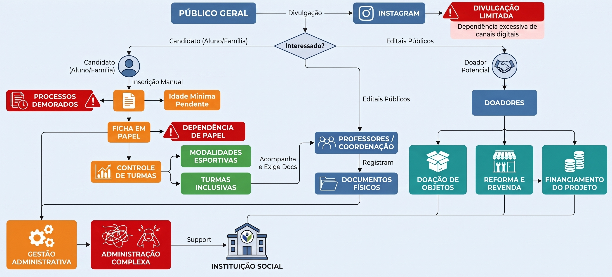
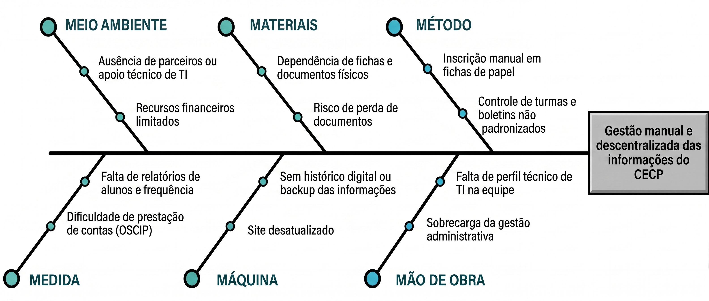

# VISÃO DO PRODUTO E PROJETO

## 1 CENÁRIO ATUAL DO CLIENTE E DO NEGÓCIO

### 1.1 Identificação do Cliente/Parceiro

**Nome:** Centro Esportivo Cultural de Planaltina

**Tipo:** Organização da Sociedade Civil de Interesse Público

**Representante:** Pedro Augusto Cajado Coutinho.

**Forma de contato:** Reuniões periódicas por videoconferência, canal de mensagens instantânea e email.

**Vínculo com o projeto:** Cliente real e parte interessada principal, responsável por fornecer informações sobre o negócio, validar as decisões do projeto e avaliar as entregas realizadas ao longo do desenvolvimento.

### 1.2 Introdução ao Negócio e Contexto

O Centro Esportivo Cultural de Planaltina DF (CECP) é uma organização social brasileira que atua no Distrito Federal desde 2014. Qualificada como Organização da Sociedade Civil de Interesse Público (OSCIP) junto ao Ministério da Justiça, a instituição utiliza as Artes Marciais como ferramenta de prevenção à criminalidade e de promoção do desenvolvimento sociocultural e esportivo da comunidade.

A organização opera de forma presencial, em Planaltina-DF, onde são realizadas as atividades em regime de contraturno escolar. O trabalho é sustentado por um grupo de jovens voluntários, lutadores e profissionais de diversas áreas. Não possui estrutura digital de divulgação, captação de recursos ou gestão de alunos.

A missão do CECP é comprometer jovens líderes com o desenvolvimento da comunidade, formando uma consciência social verdadeira por meio de ações positivas em favor da infância mais necessitada, tendo como valores centrais a amizade, o respeito, a sinceridade e a solidariedade.

O público-alvo principal são pessoas e famílias em situação de vulnerabilidade social, sobretudo de baixa renda, em regiões próximas de Planaltina. Um diferencial do projeto é a condicionalidade da permanência dos alunos ao bom desempenho escolar, exigindo o acompanhamento periódico de boletins e podendo resultar em sanções disciplinares em casos de queda de rendimento ou desvios de comportamento.

### 1.3 Rich Picture

*Figura 1 – Rich Picture*
*Produzido pelos autores – 2026*

A Figura 1 apresenta o mapeamento do fluxo atual de operação do CECP, elaborado a partir do levantamento realizado junto à organização, contemplando os processos de captação de alunos, matrícula, gestão de turmas, captação de doadores e administração geral.

O cenário atual envolve seis grupos de atores: o público geral, que toma conhecimento do projeto principalmente pelo Instagram; os candidatos (alunos e famílias) interessados em ingressar no projeto; os professores e a coordenação, responsáveis pelo acompanhamento pedagógico e esportivo; os doadores potenciais, que contribuem com objetos, reformas ou financiamento; a instituição social como ponto central de todo o fluxo; e a equipe de gestão administrativa, que sustenta manualmente todos os processos.

A divulgação do projeto ocorre quase exclusivamente pelo Instagram, e o interessado, ao manifestar intenção de participar, inicia uma inscrição manual em ficha de papel, seguida da verificação de idade mínima. A partir dessa ficha física, é feito o controle de turmas, dividindo os alunos entre modalidades esportivas e turmas inclusivas. Paralelamente, professores e coordenação acompanham e exigem documentos dos alunos, os quais são registrados e arquivados como documentos físicos.

O fluxo de doadores segue um caminho distinto: potenciais doadores contribuem por meio de doação de objetos, reforma e revenda, ou financiamento direto do projeto, recursos que sustentam a instituição. Há também a via de editais públicos, que se conecta diretamente à coordenação. Todos esses fluxos convergem, ao final, para uma gestão administrativa centralizada e sobrecarregada.

Atualmente não há sistema informatizado de apoio à gestão. O controle é feito por meio de fichas em papel, documentos físicos arquivados e o Instagram como único canal digital, restrito à divulgação.

O diagrama aponta alguns pontos críticos: a dependência do Instagram como principal canal de divulgação; a realização manual do processo de inscrição; a utilização de documentos físicos, dificultando a consulta, organização e preservação do histórico das informações; e a concentração de diferentes processos na gestão administrativa, o que pode gerar sobrecarga e retrabalho.

A organização também apresenta algumas restrições relevantes para o projeto, como a atuação de uma equipe voluntária, a ausência de uma estrutura própria de tecnologia da informação, a limitação de recursos financeiros para aquisição e manutenção de sistemas comerciais e a necessidade de uma solução compatível com a realidade operacional da instituição.

Diante desse cenário, identificam-se oportunidades de melhoria, especialmente na organização e digitalização das informações. A digitalização das fichas de inscrição e do controle de turmas pode reduzir a dependência de documentos físicos e facilitar o acompanhamento dos alunos. Da mesma forma, a centralização dos documentos em meio digital pode facilitar o acesso e a organização das informações necessárias ao acompanhamento dos participantes. Também existe oportunidade de melhorar o registro e o acompanhamento das informações relacionadas aos doadores, tornando esse processo mais organizado e menos dependente de contatos informais.

### 1.4 Identificação da Oportunidade ou Problema

*Figura 2 – Diagrama de Ishikawa*
*Produzido pelos autores – 2026*

A Figura 2 apresenta o diagrama de Ishikawa, um mapa que mostra os principais agentes responsáveis pelo problema enfrentado pela organização, elaborado a partir do levantamento realizado junto à organização, contemplando as principais dificuldades enfrentadas pelos organizadores e colaboradores da organização.

O projeto é necessário para solucionar problemas relacionados a gestão, organização e armazenamento de dados da organização. Atualmente, grande parte das informações referentes aos alunos, inscrições, turmas e doações é mantida em documentos físicos e de difícil organização. Essa situação dificulta o armazenamento, a localização e a atualização das informações, além de tornar o acompanhamento das turmas e dos documentos dos alunos mais trabalhoso e suscetível a perdas ou desorganização.

Outro problema identificado está relacionado à gestão das doações recebidas pela organização. A ausência de uma estrutura digital específica dificulta o registro, o acompanhamento e a organização das informações referentes aos doadores e às contribuições realizadas. Como consequência, existe uma oportunidade de melhorar os processos internos por meio da digitalização e centralização das informações, facilitando o acesso aos dados e tornando a gestão das atividades mais organizada e eficiente.

Além disso, a organização enfrenta dificuldades relacionadas à divulgação de suas atividades e à participação em editais públicos. A ausência de um site atualizado, com informações organizadas e de fácil acesso, pode limitar o atendimento aos requisitos de determinados editais e reduzir a capacidade da organização de apresentar adequadamente seus projetos e resultados.

Dessa forma, o projeto apresenta uma oportunidade de modernizar a gestão e a comunicação da organização, centralizando informações que atualmente se encontram dispersas em documentos físicos e canais distintos. A plataforma digital proposta poderá contribuir tanto para a organização dos processos internos quanto para a divulgação institucional, criando melhores condições para o acompanhamento das atividades e para a busca de novas oportunidades de financiamento e parcerias.

### 1.5 Desafios do Projeto

O projeto enfrenta três desafios principais:

**Desafio 1 - Modernização da presença digital institucional:** Embora o cliente utilize o Instagram para divulgar suas atividades, alguns editais públicos exigem que a organização possua um site para apresentar informações sobre seus projetos, atividades e resultados. Atualmente, existe um site institucional, porém ele está desatualizado e apresenta as informações de maneira pouco organizada e de difícil visualização. Dessa forma, será necessário estruturar uma nova apresentação das informações, tornando o conteúdo mais acessível, organizado e adequado às necessidades da organização e aos requisitos de possíveis editais.

**Desafio 2 - Digitalização da gestão administrativa:** Atualmente, as inscrições, informações das turmas, documentações dos alunos e registros de doações são gerenciados quase unicamente por meio de documentos físicos. Com o crescimento do volume de documentos, esse modelo torna o armazenamento mais complexo e dificulta a localização, atualização e acompanhamento das informações. Além disso, a utilização de registros não integrados aumenta o esforço necessário para realizar atividades administrativas e pode favorecer a ocorrência de erros ou perda de informações.

**Desafio 3 - Adoção da solução por uma equipe voluntária:** Como a operação do CECP depende de voluntários com disponibilidade e perfis técnicos variados, a solução precisa ser simples e intuitiva o suficiente para não gerar resistência ou sobrecarga adicional à equipe. Esse desafio orienta diretamente as decisões de escopo e tecnologia do projeto, priorizando uma ferramenta enxuta em vez de um sistema robusto e complexo.

Assim, o projeto deverá enfrentar o desafio de transformar processos atualmente realizados de forma predominantemente analógica em processos digitais, organizados e de fácil acesso, sem comprometer a simplicidade de utilização pela equipe responsável. A solução também deverá conciliar as necessidades de gestão interna com a necessidade de disponibilizar informações institucionais de forma clara e atualizada para o público externo e para processos de participação em editais.

### 1.6 Mapa de Stakeholders

Os principais stakeholders do projeto são: Pedro Augusto Cajado Coutinho, como principal responsável por validar prioridades e entregas. Além disso, ele compartilha as mesmas características de um "professor do CECP"; professores do CECP, diretamente impactados pela digitalização dos documentos e responsáveis por administrar as turmas; clientes do CECP, que serão beneficiados pela digitalização das matrículas; e a equipe de desenvolvimento, responsável por implementar a solução e viabilizar tecnicamente a integração, a usabilidade, a segurança e a escalabilidade da plataforma com base no escopo de projeto.

*Figura 3 – Mapa de Stakeholders*
*Produzido pelos autores – 2026*

| Stakeholder | Relação com a solução | Interesse principal | Influência |
|---|---|---|---|
| Pedro Augusto Cajado Coutinho | Representante do cliente | Validar escopo, prioridades e entregas | Alta |
| Professores do Projeto | Gestão interna | Diretamente impactados pela digitalização dos documentos e serão responsáveis por administrar as turmas | Alta |
| Clientes do CECP | Usuários finais | Beneficiados pela digitalização das matrículas | Média |
| Equipe de desenvolvimento | Responsável pela construção do produto | Entregar uma solução viável e de qualidade | Alta |

### 1.7 Segmentação de Clientes

A CECP tem quatro principais tipos de clientes:

- **Candidatos (crianças, jovens e adultos):** Buscam ingressar nas atividades oferecidas pela CECP no contraturno escolar, ocupando esse tempo livre com práticas esportivas. Procuram lazer, desenvolvimento motor e pessoal, além de bem-estar e autoestima, em um ambiente que afasta da violência.

- **Responsáveis (jovens adultos, adultos e idosos):** Acompanham o desenvolvimento de crianças e adolescentes nas atividades da CECP, sendo responsáveis por matricular o aluno, levá-lo às aulas e acompanhar as redes sociais da instituição.

- **Doadores:** Contribuem com o CECP por meio de doações financeiras ou de itens, como móveis, que posteriormente são reformados e revendidos pela equipe da instituição.

- **Público geral:** Toma conhecimento da CECP majoritariamente pelas redes sociais, acompanhando os projetos, resultados e histórias de impacto divulgados, podendo se tornar futuros voluntários, doadores ou multiplicadores da causa junto a outras famílias da comunidade.