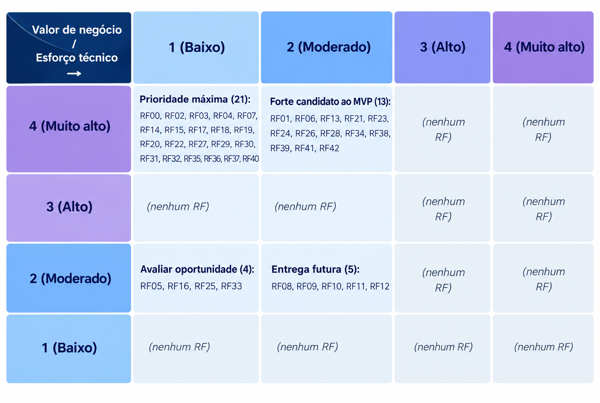

# Priorização dos requisitos e definição do MVP
 
## 1. Critérios e escalas
 
**Valor de negócio (MoSCoW):** avaliado com o cliente, com a escala abaixo.
 
| Pontuação | Classificação | Interpretação |
|:---:|---|---|
| 4 | Tem que ter (Must have) | Indispensável para resolver o problema central ou viabilizar o produto |
| 3 | Deveria ter (Should have) | Muito importante, mas o produto pode operar temporariamente sem o requisito |
| 2 | Poderia ter (Could have) | Agrega valor, mas pode ser adiado sem comprometer o objetivo principal |
| 1 | Não precisa ter (Won't have now) | Não é prioritário para a versão atual |
 
**Esforço técnico:** avaliado pela equipe em três dimensões, todas orientadas no mesmo sentido (maior nota, maior dificuldade).
 
| Pontuação | Esforço | Complexidade | Lacuna de capacidade da equipe |
|:---:|---|---|---|
| 1 | Até 2 horas | Solução conhecida, com poucas dependências | A equipe domina plenamente o necessário |
| 2 | Entre 2 e 5 horas | Exige alguma investigação ou integração | Conhecimento suficiente, com pouca aprendizagem adicional |
| 3 | Entre 5 e 8 horas | Várias dependências ou incertezas técnicas | A equipe precisa desenvolver conhecimentos relevantes |
| 4 | Mais de 8 horas | Elevada incerteza, integração crítica ou tecnologia não dominada | A equipe ainda não possui os conhecimentos ou recursos |
 
**Consolidação:** o esforço técnico consolidado é a média simples de esforço, complexidade e lacuna de capacidade, com uma casa decimal. Para posicionar o RF na matriz (seção 3), o valor é arredondado para o inteiro mais próximo.
 
## 2. Avaliação consolidada
 
| Código | Requisito | Valor de negócio | Esforço | Complexidade | Lacuna | Esforço técnico |
|---|---|:---:|:---:|:---:|:---:|:---:|
| RF00 | Encerrar sessão | 4 | 1 | 1 | 2 | 1,3 |
| RF01 | Autenticar usuário | 4 | 2 | 2 | 2 | 2,0 |
| RF02 | Controlar acesso | 4 | 1 | 1 | 1 | 1,0 |
| RF03 | Cadastrar turma | 4 | 1 | 1 | 1 | 1,0 |
| RF04 | Editar turma | 4 | 1 | 1 | 1 | 1,0 |
| RF05 | Inativar turma | 2 | 1 | 1 | 1 | 1,0 |
| RF06 | Associar aluno à turma | 4 | 2 | 2 | 1 | 1,7 |
| RF07 | Consultar alunos de uma turma | 4 | 1 | 1 | 1 | 1,0 |
| RF08 | Registrar doação recebida | 2 | 2 | 2 | 2 | 2,0 |
| RF09 | Editar doação recebida | 2 | 2 | 2 | 2 | 2,0 |
| RF10 | Registrar documentos de prestação de contas | 2 | 3 | 2 | 2 | 2,3 |
| RF11 | Editar documentos de prestação de contas | 2 | 2 | 2 | 2 | 2,0 |
| RF12 | Consultar doações e prestações de contas | 2 | 2 | 2 | 1 | 1,7 |
| RF13 | Publicar conteúdo institucional | 4 | 3 | 2 | 2 | 2,3 |
| RF14 | Editar conteúdo institucional | 4 | 2 | 1 | 1 | 1,3 |
| RF15 | Consultar conteúdo institucional | 4 | 1 | 1 | 1 | 1,0 |
| RF16 | Remover conteúdo institucional | 2 | 1 | 1 | 1 | 1,0 |
| RF17 | Publicar evento | 4 | 1 | 1 | 1 | 1,0 |
| RF18 | Editar evento | 4 | 1 | 1 | 1 | 1,0 |
| RF19 | Remover evento | 4 | 1 | 1 | 1 | 1,0 |
| RF20 | Consultar eventos | 4 | 1 | 1 | 1 | 1,0 |
| RF21 | Cadastrar aluno | 4 | 2 | 2 | 2 | 2,0 |
| RF22 | Editar aluno | 4 | 1 | 1 | 1 | 1,0 |
| RF23 | Consultar ficha do aluno | 4 | 2 | 2 | 1 | 1,7 |
| RF24 | Inativar aluno | 4 | 2 | 1 | 2 | 1,7 |
| RF25 | Remover dados do aluno | 2 | 1 | 1 | 1 | 1,0 |
| RF26 | Registrar frequência | 4 | 2 | 2 | 2 | 2,0 |
| RF27 | Consultar frequência | 4 | 1 | 1 | 1 | 1,0 |
| RF28 | Emitir alerta de faltas críticas | 4 | 2 | 2 | 2 | 2,0 |
| RF29 | Registrar medida disciplinar | 4 | 1 | 1 | 1 | 1,0 |
| RF30 | Publicar aviso | 4 | 1 | 1 | 1 | 1,0 |
| RF31 | Consultar avisos | 4 | 1 | 1 | 1 | 1,0 |
| RF32 | Editar aviso | 4 | 1 | 1 | 1 | 1,0 |
| RF33 | Remover aviso | 2 | 1 | 1 | 1 | 1,0 |
| RF34 | Consultar histórico de avisos | 4 | 2 | 2 | 1 | 1,7 |
| RF35 | Acessar formulário de matrícula online | 4 | 1 | 1 | 1 | 1,0 |
| RF36 | Preencher dados do aluno | 4 | 1 | 1 | 1 | 1,0 |
| RF37 | Informar dados do responsável legal | 4 | 1 | 1 | 1 | 1,0 |
| RF38 | Registrar consentimento de dados pessoais | 4 | 2 | 2 | 2 | 2,0 |
| RF39 | Registrar termo de uso de imagem | 4 | 2 | 2 | 1 | 1,7 |
| RF40 | Informar pessoas autorizadas a retirar o aluno | 4 | 1 | 1 | 1 | 1,0 |
| RF41 | Emitir comprovante de solicitação | 4 | 2 | 2 | 2 | 2,0 |
| RF42 | Analisar solicitações de matrícula | 4 | 2 | 2 | 1 | 1,7 |
 
As justificativas do cliente para cada valor de negócio estão registradas nas atas das reuniões de 22/09/2026 e 24/09/2026 e nas validações complementares por WhatsApp e áudio.

## 3. Matriz 4 × 4

- **Prioridade máxima** (valor 4, esforço baixo): 21 RFs.
- **Forte candidato ao MVP** (valor 4, esforço moderado): 13 RFs.
- **Avaliar oportunidade** (valor 2, esforço baixo): RF05, RF16, RF25 e RF33.
- **Adiar** (valor 2, esforço moderado): RF08 a RF12.
- Nenhum RF ficou com esforço alto ou muito alto, então não foi necessário decompor requisitos nem planejar entrega parcial.

## 4. Definição do MVP
 
O MVP reúne **37 dos 43 RFs**. A seleção considerou a posição na matriz, a necessidade de um fluxo de uso minimamente completo e as dependências entre requisitos.
 
| Módulo | RFs |
|---|---|
| Acesso e controle de usuários (base de todo o fluxo) | RF00 a RF02 |
| Gestão e acompanhamento de turmas (CP1) | RF03, RF04, RF06, RF07 |
| Gestão de conteúdo institucional (CP3) | RF13 a RF20 |
| Cadastro e histórico de alunos (CP4) | RF21 a RF25 |
| Acompanhamento pedagógico e disciplinar (CP5) | RF26 a RF29 |
| Comunicação com voluntários e famílias (CP6) | RF30 a RF34 |
| Matrícula online (CP7) | RF35 a RF42 |
 
O conjunto cobre todas as posições de "Prioridade máxima" e "Forte candidato ao MVP" e forma um fluxo completo: autenticação, gestão de turmas, cadastro e acompanhamento de alunos, medidas disciplinares, conteúdo institucional, avisos e pré-matrículas pelo módulo público.
 
**RF16, RF25 e RF33** ficaram em "Avaliar oportunidade" (valor 2, esforço 1,0), mas entraram no MVP porque cada um completa um par funcional já presente (RF16 com RF13 a RF15; RF33 com RF30 a RF32) e RF25 tem peso legal via RNF13 (LGPD). Sem eles, esses módulos ficariam sem a remoção correspondente.

### RFs não incluídos no MVP (6 de 43)

| RF | Motivo |
|---|---|
| RF05 | Valor 2 ("poderia ter"); a inativação de turma pode ser adiada sem comprometer o fluxo mínimo |
| RF08 a RF12 | Valor 2 ("poderia ter") e esforço moderado; RF09 e RF11 decorrem de RF08 e RF10, e RF10 tem o maior esforço do conjunto (2,3) |

## 5. Tratamento dos RNFs

| ID | Descrição | Classificação | Justificativa |
|---|---|---|---|
| RNF01 | Interface que permite ao usuário realizar tarefas sem precisar de muito tempo de aprendizado ou treinamento para voluntários sem experiência técnica (CP1, CP3, CP4, CP5) | **Obrigatório para o MVP** | Critério de aceite validado com o cliente em 23/09 (usuários novatos cumprem tarefas em até 8 min, 80% de sucesso); aplica-se a todos os fluxos administrativos selecionados no MVP |
| RNF02 | O módulo público deve adaptar sua interface ao tamanho da tela, mantendo legibilidade e organização em diferentes resoluções | **Associado a RFs do MVP** | Aplica-se especificamente aos RFs do módulo público presentes no MVP: RF13-RF20 (conteúdo institucional/eventos), RF30-RF34 (avisos) e RF35-RF42 (matrícula online) |
| RNF03 | Feedback ao usuário em ações críticas, como registrar frequência, aplicar medida disciplinar e inativar aluno ou turma | **Obrigatório para o MVP** | Cobre ações críticas presentes no MVP: RF26 (registrar frequência), RF29 (medida disciplinar), RF24 (inativar aluno) e RF25 (remover dados do aluno) |
| RNF04 | Preservação de histórico ao inativar turma ou aluno | **Obrigatório para o MVP** | Condição para RF24 (inativar aluno), que está no MVP. |
| RNF05 | O sistema deve solicitar confirmação antes da execução de ações críticas que possam alterar ou inativar registros relevantes | **Obrigatório para o MVP** | Aplica-se a RF24 (inativar aluno), RF25 (remover dados) e RF29 (medida disciplinar), todos no MVP |
| RNF06 | Resposta das consultas internas em até 3s (ficha do aluno, frequência, turmas) | **Obrigatório para o MVP** | Critério de aceite validado com o cliente; aplica-se diretamente a RF07 (consultar alunos de turma), RF23 (ficha do aluno) e RF27 (consultar frequência), todos no MVP |
| RNF07 | Carregamento da página pública em até 5s (CP2, CP3) | **Associado a RFs do MVP** | Aplica-se ao módulo público do MVP: RF15 (conteúdo institucional), RF20 (eventos), RF31 (avisos) e RF35 (formulário de matrícula) |
| RNF08 | O sistema deve suportar o acesso simultâneo de usuários autenticados sem ultrapassar os limites de desempenho definidos para as operações internas | **Evolutivo** | Relevante para escala (10 sessões simultâneas), mas não bloqueia a entrega inicial do MVP com a equipe reduzida de coordenação da ONG |
| RNF09 | Logs de operações críticas | **Obrigatório para o MVP** | Segurança mínima exigida para toda criação/edição/inativação/remoção presente no MVP (turma, aluno, medida disciplinar) |
| RNF10 | O sistema deve utilizar padrões e tecnologias web atuais e amplamente adotados, garantindo compatibilidade com navegadores modernos | **Obrigatório para o MVP** | Condição mínima de suportabilidade para qualquer usuário (coordenação, voluntário, família) acessar o sistema |
| RNF11 | Controle de acesso por perfil (coordenação, professor/voluntário, família) | **Obrigatório para o MVP** | Diretamente associado a RF00-RF02 (sessão, autenticação, controle de acesso), base de segurança de todo o sistema no MVP |
| RNF12 | Senhas com hash e dados sensíveis criptografados | **Obrigatório para o MVP** | Segurança mínima indispensável, mesmo tendo sido classificado como "poderia ter" no MoSCoW ao vivo  divergência já registrada nas lições aprendidas da equipe |
| RNF13 | O sistema deve tratar os dados pessoais de acordo com os princípios, direitos dos titulares e requisitos de segurança e tratamento estabelecidos pela LGPD (Lei nº 13.709/2018), incluindo solicitação de eliminação quando cabível | **Obrigatório para o MVP** | Obrigatório por lei para RF38 (consentimento de dados pessoais), RF21 (cadastro de aluno) e RF25 (remoção de dados), todos no MVP. |

## 6. Validação do MVP
 
A lista final do MVP foi validada com o cliente (CECP) em quatro momentos, registrados abaixo.
 
### Quem participou e quando
 
| Data | Participantes | Foco da validação |
|---|---|---|
| 22/09/2026 | Marcos; José Ivan do Nascimento e Sandra Barbosa Lopes (CECP) | Levantamento de RFs e RNFs, cada um com critério de aceite; ideia da matrícula online (RF35 a RF42), sugerida por Sandra |
| 24/09/2026 | Marcos; Pedro Augusto Cajado Coutinho e Marco Xavier Santana (CECP) | Entrevista sobre o acompanhamento disciplinar e priorização MoSCoW de todos os RFs e RNFs |
| Após 24/09/2026 (WhatsApp) | Marcos e o cliente | MoSCoW dos 9 RFs pendentes (RF00, RF07, RF09, RF11, RF16, RF18, RF20, RF32, RF33) |
| Após 24/09/2026 (áudio) | Marcos e o cliente | Unificação de RF08 a RF12 e política de remoção de dados do aluno (RF25) |
 
### RFs aprovados para o MVP
 
37 RFs: RF00 a RF04, RF06, RF07 e RF13 a RF42 (módulos listados na seção 4).
 
### RNFs aplicáveis ao MVP
 
- **Obrigatórios:** RNF01, RNF03, RNF04, RNF05, RNF06, RNF09, RNF10, RNF11, RNF12 e RNF13.
- **Associados a RFs do MVP:** RNF02 e RNF07 (módulo público).
### Requisitos para entregas futuras
 
- **RFs:** RF05 e RF08 a RF12.
- **RNFs:** RNF08 (acesso simultâneo), classificado como evolutivo.
### Ajustes solicitados
 
- **RF28:** limite do alerta de faltas críticas alterado de 10 para 8 faltas (22/09).
- **Módulo público:** resolução mínima de 360px para exibição sem sobreposição ou corte (RNF02, 22/09).
### Decisões e divergências registradas
 
- **RF24 e RF25:** ações independentes. A inativação ocorre ao aluno sair do CECP; a remoção de dados só ocorre mediante pedido formal do titular ou responsável legal, sem conflito com RNF04 e RNF13.
- **RF08 a RF12:** inconsistência entre as classificações resolvida com a unificação em "poderia ter" (RF10 foi rebaixado de "tem que ter").
- **RNF12:** classificado como "poderia ter" no MoSCoW ao vivo, mas mantido como obrigatório por ser segurança mínima; divergência registrada nas lições aprendidas da equipe.
O detalhamento das discussões de cada reunião, incluindo a regra de retenção de dados, está nas atas.